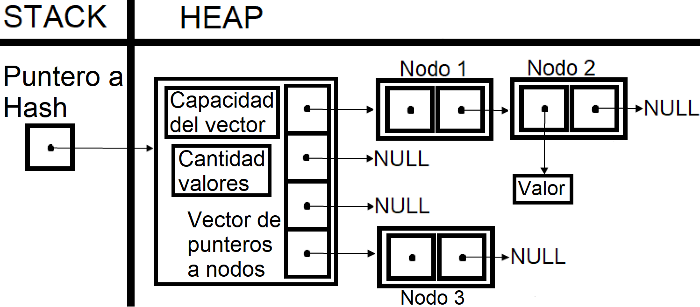
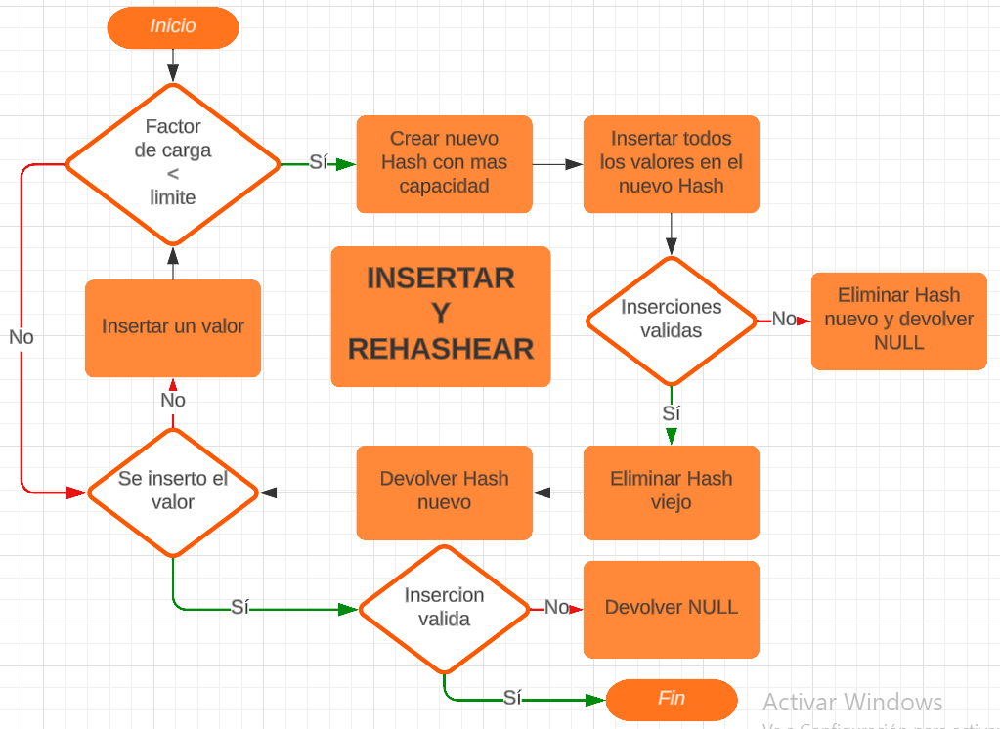

<div align="right">

</div>

# TDA HASH

## Repositorio de Matias Ferrero - 109886 - mferreroc@fi.uba.ar

- Para compilar y correr pruebas locales con makefile:

```
make
```

- Para compilar y correr ejemplo con makefile:

```
make valgrind-ejemplo
```

- Para compilar y correr pruebas de la catedra con makefile:

```
make valgrind-chanutron
```
---
##  Funcionamiento

Este programa implementa el TDA Hash abierta, o tabla de Hash abierta, con su iterador interno. El programa recibe los datos necesarios que entrega el usuario (claves, valores, funciones, etc.), con la siguiente estructura:

<div  align="center">

</div>

Para la mayoría de las operaciones se reciben claves que están emparejadas con el valor que representan, por lo que el TDA maneja únicamente las claves mediante una función, la cual vamos a llamar `función de Hash`. Esta función nos devuelve la posición del par clave/valor en el vector, pero para asegurar que esa posición es válida y está dentro del vector, se utiliza como posición el resto de la división entera, entre el numero que devuelve la función y la capacidad del Hash. 
Particularmente, al crear el TDA, se recibe un numero entero positivo que va a ser la capacidad inicial de la tabla. En caso de exceder esa capacidad, o en su defecto un limite previamente establecido llamado factor de carga máximo (el factor de carga de una tabla de Hash se obtiene dividiendo la cantidad de valores insertados por la capacidad de la tabla), el Hash se encarga de agrandar esa capacidad para mantener funcional a la tabla, operación que vamos a llamar `rehashear`. Además de rehashear, el TDA realiza las siguientes operaciones:

- Crear: Crea la tabla de Hash y reserva memoria para la tabla, el vector de la tabla, e inicializa la tabla, (complejidad con Big (O): todas las operaciones de esta función son O(1)).
- Insertar: Busca la posición en el vector de la tabla, dada por la función de Hash, reserva memoria para el nodo que guarda el par clave/valor , guardando en ese nodo una copia de esa clave reservándole memoria, y lo inserta, encadenado a los nodos que colisionen, en esa posición. Si la clave a insertar ya fue insertada previamente, la función reemplaza el valor del par insertado, con el valor a insertar, devolviendo mediante un puntero pasado por parámetro, el valor anteriormente guardado. En caso de superar el factor de carga máximo pre o posterior a insertar, la función también rehashea la tabla al doble de su capacidad actual. Por último, la función devuelve el Hash, o NULL en caso de error, (complejidad con Big (O): en caso de rehashear, hay que reinsertar los n nodos insertados, por lo que en el peor caso la función es O(n)).
- Quitar: Busca la posición en el vector de la tabla, dada por la función de Hash, libera la memoria del nodo insertado que guarda el par clave/valor, y devuelve el valor del par que se elimina, o NULL si no se encuentra la clave del par a eliminar, (complejidad con Big (O): si la función de Hash causa que todos los valores colisionen, buscar la clave a eliminar deriva en recorrer los n nodos insertados, ya que los n nodos están en la misma posición, por lo que en el peor caso la función es O(n), aunque en casos promedio la función es O(1)).
- Obtener: Busca la posición en el vector de la tabla, dada por la función de Hash, y devuelve el valor del par que se obtiene, o NULL si no se encuentra la clave del par a obtener, (complejidad con Big (O): si la función de Hash causa que todos los valores colisionen, buscar la clave a obtener deriva en recorrer los n nodos insertados, ya que los n nodos están en la misma posición, por lo que en el peor caso la función es O(n), aunque en casos promedio la función es O(1)).
- Contiene: Busca la posición en el vector de la tabla, dada por la función de Hash, y devuelve true si se encuentra, o false si no se encuentra la clave del par buscado, (complejidad con Big (O): si la función de Hash causa que todos los valores colisionen, buscar la clave deriva en recorrer los n nodos insertados, ya que los n nodos están en la misma posición, por lo que en el peor caso la función es O(n), aunque en casos promedio la función es O(1)).
- Cantidad: Devuelve la cantidad de pares insertados, guardada en la estructura del TDA, (complejidad con Big (O): todas las operaciones de esta función son O(1)).
- Destruir: Elimina todos los nodos insertados y sus claves, colisionados o no colisionados, elimina el vector, y la tabla de Hash, (complejidad con Big (O): eliminar todos los nodos deriva en recorrer los n nodos insertados en la tabla, por lo que la función es O(n)).
- Iterador interno: Recorre todos los pares insertados y les aplica una función pasada por parámetro, (complejidad con Big (O): recorre los n nodos insertados en la tabla, por lo que la función es O(n), aunque depende de la complejidad de la función que se aplica a cada nodo).

<div  align="center">

</div>

Para la implementación del TDA en las funciones `hash_insertar`, `hash_quitar`, `hash_contiene`, y `hash_obtener`, se utiliza la siguiente función de Hash:

```c
size_t  funcion_hash(const  char *clave)
{
size_t  hash = 5381;
int  c;

while ((c = *clave++))
	hash = ((hash << 5) + hash) + (size_t)c;

return  hash;
}
```

```c
size_t posicion = funcion_hash(clave) % hash->capacidad;
```

Por último, para esta implementación de la función de rehash, se copian los nodos y se insertan en un nuevo Hash con doble capacidad que el anterior. Para copiar e insertar cada nodo, se utiliza el iterador interno del TDA que ya recorre todos los nodos del Hash original, pasando por parámetro a la función del iterador, una función booleana que copia e inserta los nodos. Esto implica reservar memoria para todas las copias mediante `malloc`, y liberar los originales mediante `free`, lo cual no es ideal considerando que se pueden reajustar los punteros a los nodos, sin necesidad de pedir más memoria.
Teniendo esto en cuenta, esta es otra función de rehash (donde `hash_con_cada_clave` es la función del iterador interno), que reajusta los punteros de los nodos y no reserva memoria extra:

```c
typedef struct aux {
	hash_t *hash;
	nodo_t **vector_nuevo;
} aux_t;

void  insertar_nodo(hash_t *hash, size_t  posicion, nodo_t *nodo)
{
	nodo->siguiente = hash->vector[posicion];
	hash->vector[posicion] = nodo;
	hash->cantidad++;
}

nodo_t *buscar_nodo_por_clave(nodo_t *nodo, const  char *clave)
{
	if (!nodo)
		return  NULL;

	if (!strcmp(nodo->clave, clave))
		return  nodo

	return  buscar_nodo_por_clave(nodo->siguiente, clave);
}

bool insertar_nodo_en_nuevo_vector(const char *clave, void *valor,
								   void *auxiliar)
{
	valor = valor;
	aux_t *aux = auxiliar;
	hash_t *hash = aux->hash;

	size_t posicion = funcion_hash(clave) % hash->capacidad;
	nodo_t *nodo = buscar_nodo_por_clave(hash->vector[posicion], clave);
	if (!nodo)
		return false;

	insertar_nodo(hash, posicion, nodo);
	return true;
}

hash_t *nuevo_rehash(hash_t *hash)
{
	aux_t *aux = malloc(sizeof(aux_t));
	if (!aux)
		return NULL;

	aux->hash = hash;
	aux->vector_nuevo = calloc(hash->capacidad * 2, sizeof(nodo_t *));
	if (!aux->vector_nuevo)
		return NULL;

	size_t insertados = hash_con_cada_clave(hash, insertar_nodo_en_nuevo_vector, aux);
	if (insertados != hash->cantidad) {
		free(aux->vector_nuevo);
		return NULL;
	}

	free(hash->vector);

	hash->capacidad *= 2;
	hash->vector = aux->vector_nuevo;

	free(aux);

	return hash;
}
```

Esta función no es parte a la implementación final ya que tiene errores, y no se pudieron solucionar sin reutilizar el iterador interno. En caso de solucionar estos errores y comprobar que funcione correctamente, esta función de rehash puede reemplazar la implementada actualmente.

## Respuestas a las preguntas teóricas

1. Qué es un diccionario:
Un diccionario es una colección de pares de una clave y su valor, en donde las claves no se pueden repetir, y al ser únicas, funcionan como indice del mismo accediendo a los valores por medio de su clave particular. La ventaja de este acceso directo, es que permite optimizar la operaciones, sobre todo la búsqueda de los valores, en casos promedio con respecto, por ejemplo, a una lista, utilizando una tabla de Hash y su función de Hash.

2. Qué es una función de Hash y qué características debe tener:
Una función de Hash es una función matemática que transforme la clave ingresada en una clave de Hash asociada a esa clave (por ejemplo, números), las cuales determinan las posiciones de los pares en la tabla. Una función de Hash ideal es aquella que, para toda clave ingresada, obtiene claves de Hash no repetidas, o sea, una función matemática biyectiva. Pero en la práctica, si se tienen infinitas claves, y un número finito claves de Hash asociadas posibles, ninguna función consigue ser ideal.
Cuando claves distintas generan posiciones iguales en la tabla, se genera una colisión de pares clave/valor. Teniendo esto en consideración, podemos determinar que hay infinitas funciones de Hash, pero las mejores funciones son aquellas que generan la menor cantidad de colisiones.
Otra característica de las funciones de Hash es que las claves que devuelve no son reversibles a las claves ingresadas, matemáticamente eso quiere decir, que la función no tiene función inversa. Si esto no sucediera, se perdería el sentido de que haya una función en primer lugar.
Por ultimo, la función de Hash es independiente de la tabla de Hash, y en caso de modificar el Hash, o cambiar de tabla, la función siempre devuelve la misma clave de Hash si se ingresa la misma clave.

3. Qué es una tabla de Hash y sus diferentes métodos de resolución de colisiones:
Una tabla es de Hash es una estructura que guarda valores a los que se puede acceder únicamente mediante su clave asociada, y utilizando una función de Hash, con la que se obtienen las posiciones de cada valor en la tabla.

Hay dos tipos de tablas de Hash:

- Tabla de Hash abierta: Una tabla abierta se caracteriza por tener `direccionamiento cerrado`, esto significa guardar cada clave en la posición exacta que devuelve la función de Hash , y guardar sus valores "por fuera" de la tabla. Esto quiere decir que en caso de colisiones, todas las claves se guardan en la misma posición, utilizando un `sistema de encadenamiento`, por ejemplo, con nodos, enlazando todas las claves que se deriven en esa posición. Al guardar los pares clave/valor encadenados, los valores no se guardan dentro de la tabla, sino que cada posición de la tabla guarda el primer nodo encadenado (o en su defecto, un puntero a ese nodo).
- Tabla de Hash cerrada: Contrario a un Hash abierto, una tabla cerrada se caracteriza por guardar todos los valores "dentro" de la tabla. En base a esto, en caso de colisiones de pares clave/valor, se utiliza un sistema de `probing` que guarda los pares que colisionan, en una posición libre posterior a la indicada. Por ejemplo, el sistema de probing lineal guarda el par que colisiona en la primera posición libre posterior a la posición indicada por la función de Hash. Por lo tanto, un Hash cerrado se caracteriza por un `direccionamiento abierto`, ya que las claves no necesariamente se guardan en la posición de la tabla que determina la función de Hash.

Además de los métodos de encadenamiento y probing, en caso de colisiones se puede utilizar una `zona de desbordamiento`, agregando otra estructura donde se guarden los pares que colisionen. En este caso, ademas de comprobar que porcentaje de la tabla esta siendo ocupada, también hay que comprobar que haya espacio en la zona de desbordamiento para agregar las posibles colisiones.
